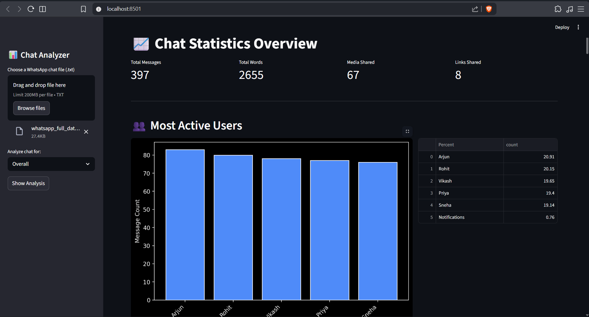
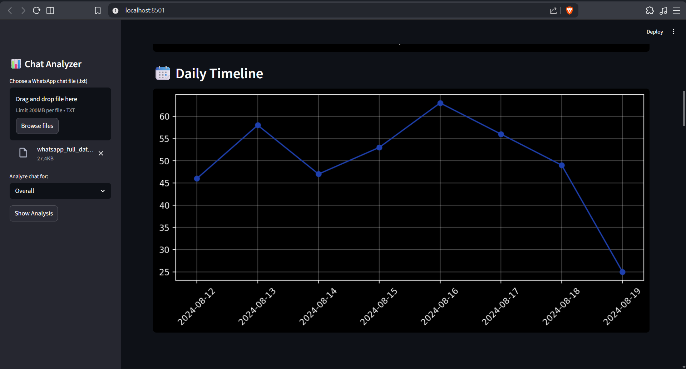
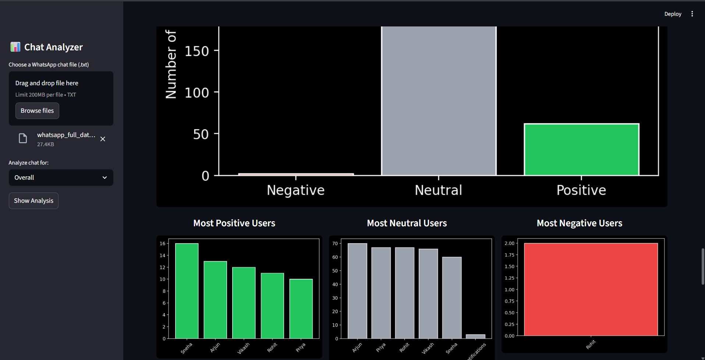
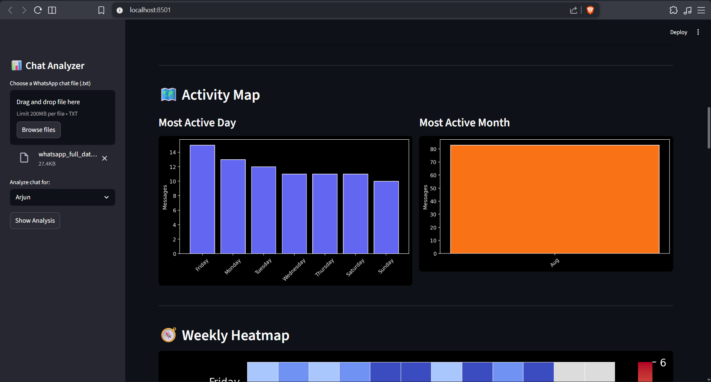
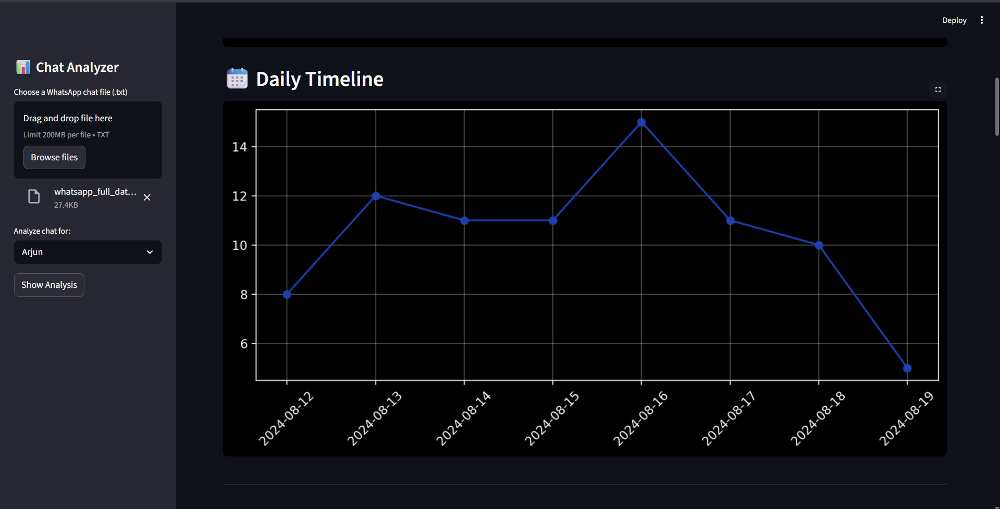

# WhatsApp Chat Analyzer

> A Streamlit app built for analyzing exported WhatsApp chat logs (TXT format).
>
> It parses the conversation into messages, corresponding users, and timestamps, then derives rich analytics including usage patterns, activity heatmaps, sentiment scoring, and textual insights.
>
> Upload a chat file and interactively explore: top communicators, word clouds, daily/monthly timelines, emoji use, and sentiment distribution.
---

## 🚀 Project Overview

`Chat Analyzer` processes WhatsApp exported chat text files and generates interactive analytics dashboards. It includes overall and per-user insights like:

- Total messages, words, media, and links
- Most active users
- Monthly and daily timelines
- Weekly activity heatmap
- Word cloud
- Most frequent words
- Emoji frequency
- Sentiment analysis (positive/neutral/negative)

The UI is powered by **Streamlit** and analytics are powered by **Pandas**, **matplotlib**, **Seaborn**, and **NLTK VADER**.

---

## 🗂️ Repository Structure

- `app.py` - Streamlit UI orchestration
- `preprocessor.py` - Chat message parsing, date handling, and feature engineering
- `helper.py` - Analytics functions (stats, timelines, wordcloud, sentiment, emojis, etc.)
- `stop_hinglish.txt` - Stopword list for Hinglish text filtering in word cloud and common words analysis
- `Datasets/` - Example WhatsApp exported conversation files
- `requirements.txt` - Python dependencies

---

## 🛠️ Features

1. File upload for WhatsApp `.txt`
2. Chat preprocessing (timestamps, user mapping, notifications)
3. Overall and user-level analysis
4. Visual timelines and map views
5. Heatmap by day and hour
6. Word cloud and frequent words
7. Emoji and sentiment breakdown

---

## ⚙️ Installation

1. Clone project:

```bash
git clone <repository-url>
cd "Chat Analyzer"
```

2. Create and activate virtual environment (Windows):

```bash
python -m venv .venv
.\.venv\Scripts\Activate.ps1
```

3. Install dependencies:

```bash
pip install -r requirements.txt
```

4. Run app:

```bash
streamlit run app.py
```
---

## 🧩 Usage

1. Open app in browser at `http://localhost:8501`
2. Upload WhatsApp exported `.txt` chat file
3. Select `Overall` for global insights, or select a specific user to view individual user analysis and stats
4. Click `Show Analysis`
5. Explore metrics and charts

---

## 📸 Screenshots

```markdown
### Main Dashboard


### Timeline 


### Sentiment Analysis


### Activity Timeline


### Emoji Analysis

### Heatmap

### Individual User Analysis

```

---

## 📝 Notes

- Chat format currently expects WhatsApp standard with `dd/mm/yy, hh:mm AM/PM -` timestamp prefix.
- If the parser fails due to non-standard format, normalize timestamps in advance.


